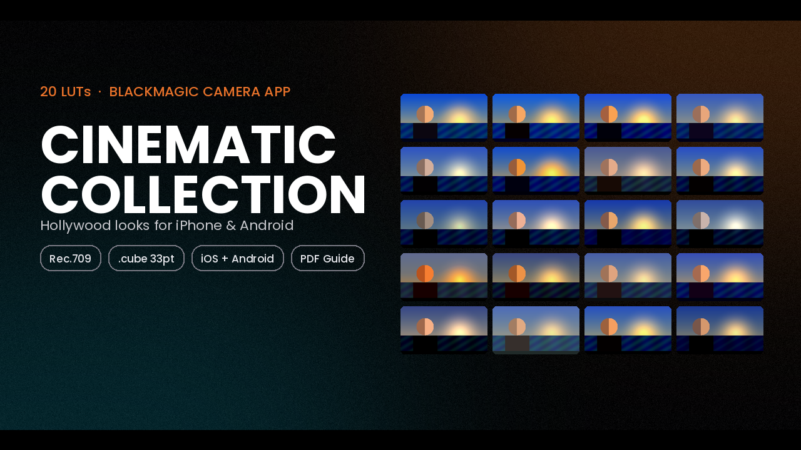
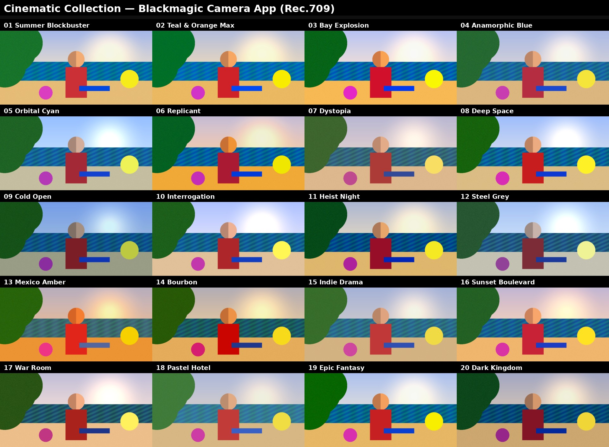
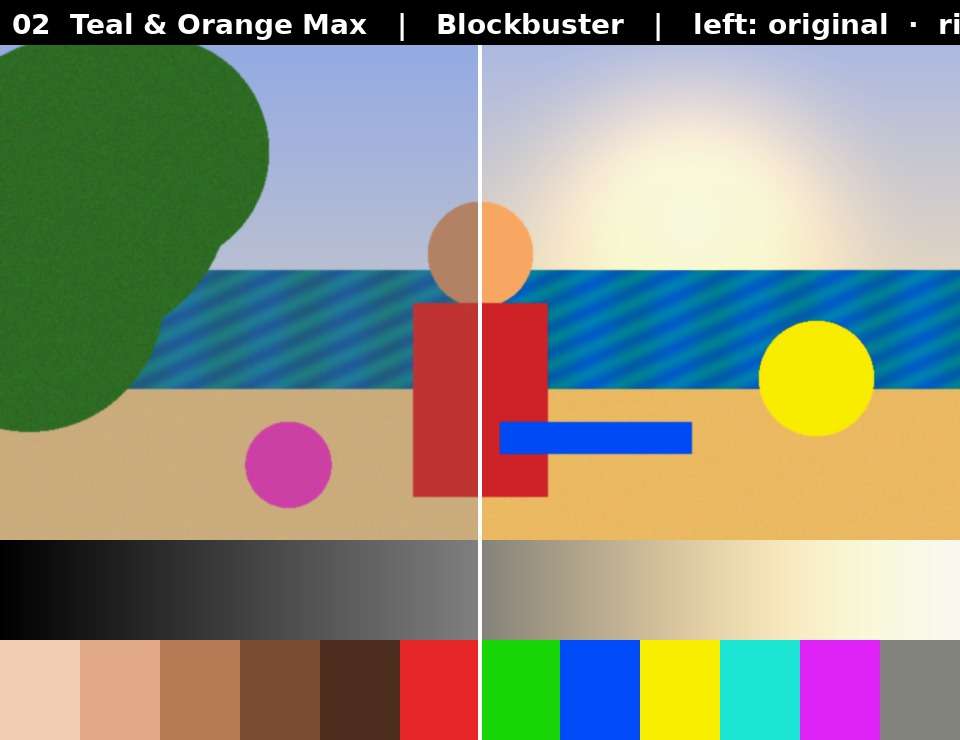
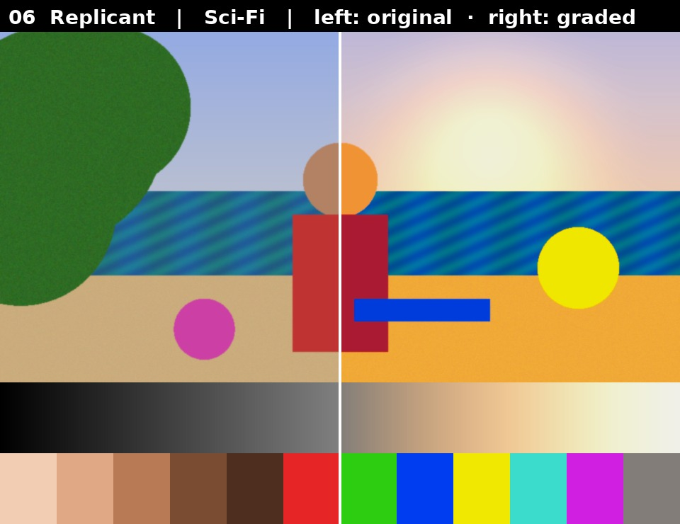
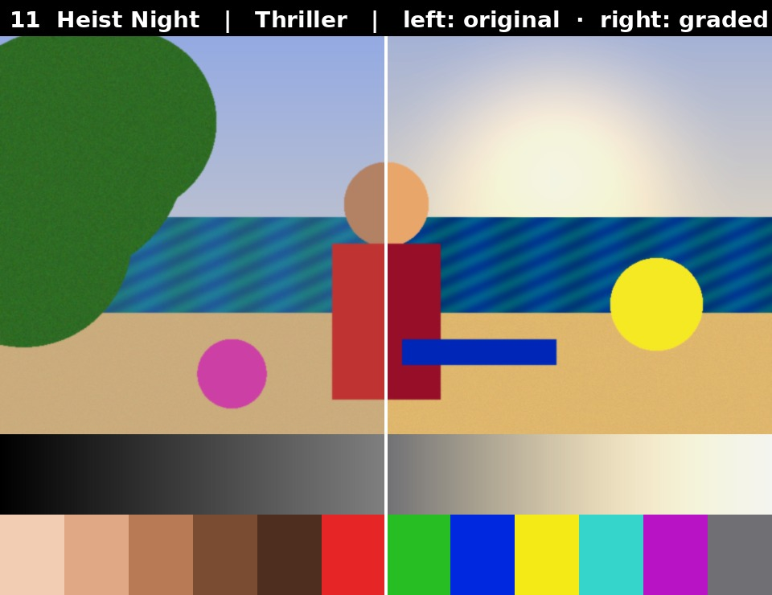
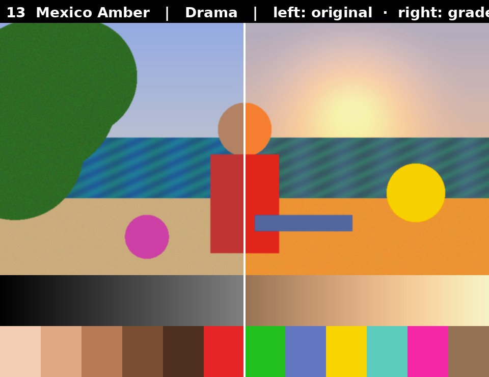
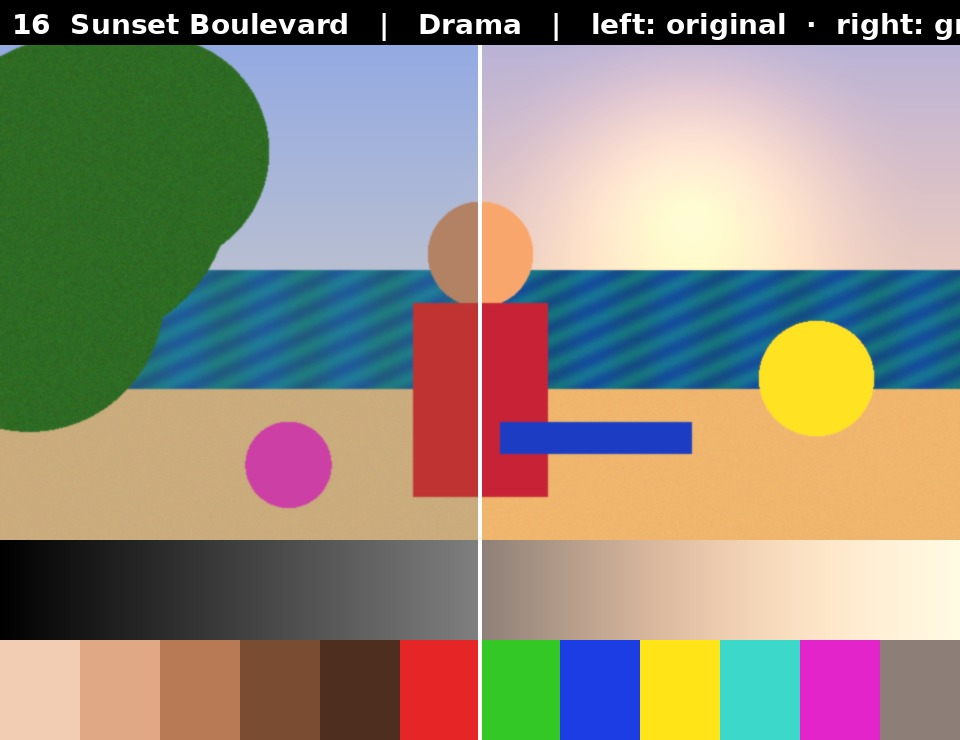
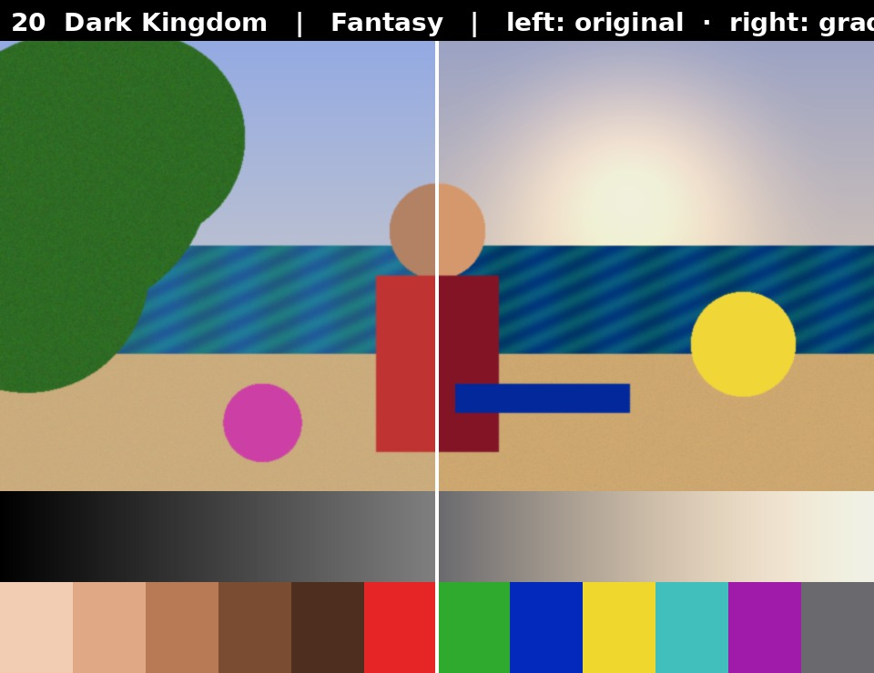

<!-- Replace every YOUR_GUMROAD_LINK below with your product URL, e.g. https://yourname.gumroad.com/l/cinematic-luts -->

  

<h1 align="center">Cinematic Collection — 20 LUTs for the Blackmagic Camera App</h1>

  Hollywood-inspired colour grades for iPhone &amp; Android. Tap once, shoot cinema.

  
  &nbsp;
  
  
  
  

---

## 👉 [Get the full pack on Gumroad](https://wikanopi.gumroad.com/l/blackmagic-camera-lut)

Every genre has a colour. This pack rebuilds 20 of the most recognisable Hollywood palettes as 3D LUTs made specifically for the free **Blackmagic Camera** app — so your phone footage looks like it came off a film set, live in the viewfinder, before you even press record.

## What's inside

| Genre | Looks |
|---|---|
| 🎬 **Blockbuster** | Summer Blockbuster · Teal & Orange Max · Bay Explosion · Anamorphic Blue |
| 🚀 **Sci-Fi** | Orbital Cyan · Replicant · Dystopia · Deep Space |
| 🔪 **Thriller** | Cold Open · Interrogation · Heist Night · Steel Grey |
| 🎭 **Drama** | Mexico Amber · Bourbon · Indie Drama · Sunset Boulevard |
| ⚔️ **Period & Fantasy** | War Room · Pastel Hotel · Epic Fantasy · Dark Kingdom |

Plus: a before/after preview for every look, a full contact sheet, and a step-by-step **PDF installation guide** for iOS, Android and desktop editors.

## All 20 looks

  

## Before / After

<table>
  <tr>
    <td></td>
    <td></td>
  </tr>
  <tr>
    <td></td>
    <td></td>
  </tr>
  <tr>
    <td></td>
    <td></td>
  </tr>
</table>

## Why these LUTs?

- **Built for Rec.709** — the Blackmagic Camera app's default output. No conversion step, no guesswork.
- **Skin-tone protected** — bold teal & orange splits without turning faces orange.
- **Soft highlight roll-off** — skies and windows hold their detail instead of clipping.
- **Industry-standard 33-point `.cube`** — the same format used in professional colour suites.

## Compatible with

Blackmagic Camera App (iOS & Android) · DaVinci Resolve · Premiere Pro · Final Cut Pro · CapCut (desktop & mobile) · VN · LumaFusion · any editor that supports `.cube` LUTs.

## How it works

1. Buy and unzip the pack.
2. Copy the `LUTs` folder to your phone.
3. In Blackmagic Camera: **Settings → Monitor → LUTs → Import LUT**.
4. Tap the **LUT** button in the viewfinder and pick a look.

> Shooting in Apple Log or Blackmagic Film? Convert to Rec.709 first — these LUTs are designed for Rec.709 footage.

## FAQ

**Does it work on Android?** Yes. The Blackmagic Camera app on Android supports `.cube` import.

**Do I need editing software?** No. Everything works inside the free Blackmagic Camera app. The LUTs also work in any desktop or mobile editor listed above.

**Can I use them on client / commercial work?** Yes — the single-user licence covers unlimited personal and commercial projects. Redistribution or resale of the LUT files is not permitted.

---

  

Instant digital download · Lifetime access · Free updates

